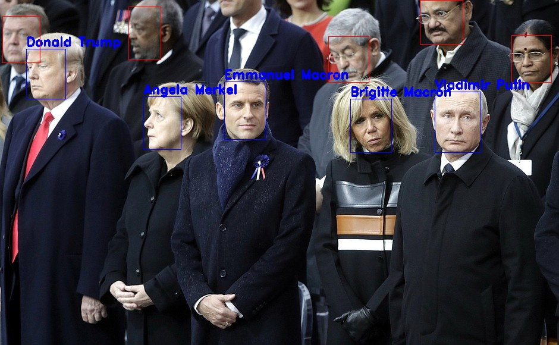
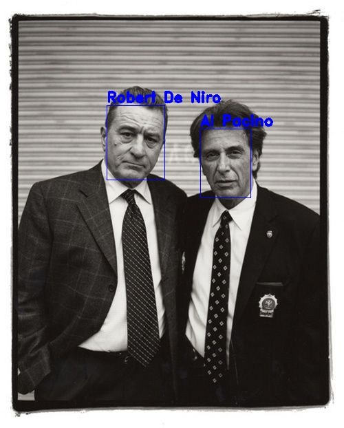
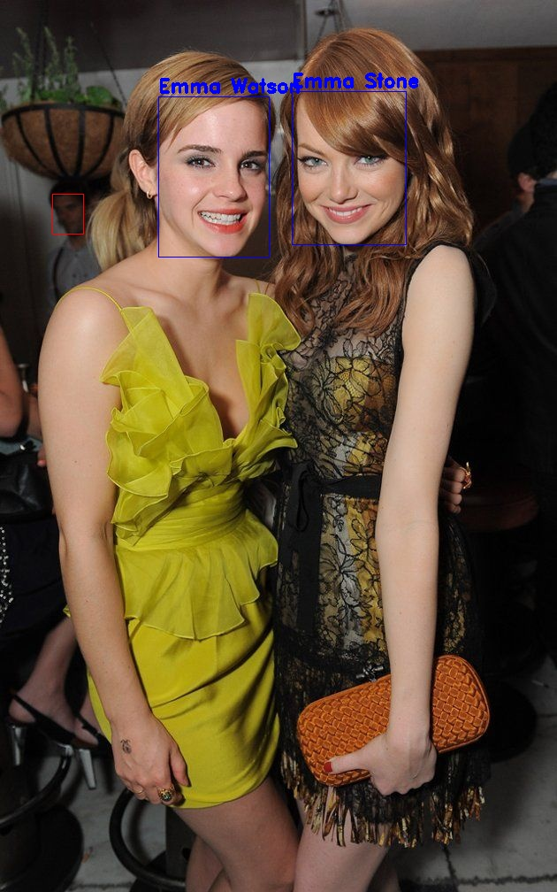

# Tensorflow2 universal face recognition framework

Face recognition framework with 80 pretrained celebrities to detect  
Easily add any person or celebrity to be recognized

example output :
   
Check out more examples at the bottom of the page !


### Installation
run
```angular2
python setup.py install
```
If you dont have a GPU, change the line tensoflow-gpu==2.0.1 to tensorflow==2.0.1 from the setup.py file.

### Run recognition
First, download the pretrained models and list of available celebrities from [DropBox](https://www.dropbox.com/sh/34vd1zmtsdch8ln/AABfP5l3ITZo5jzgvZaiZZ3ja?dl=0),
and place the models in the ./models folder

Run : 
```angular2
python recognition.py --sample_img="./sample-images/leaders.jpg" --save_destination="./sample-results/leaders_output.jpg"
```

### Example outputs




### TODO
* ~~add alignment to mtcnn~~
* ~~convert embedding extractor to tf2~~
* ~~convert RetinaFace to tf2 for better face detection~~
* ~~add nmslib knn search for face rec~~
* ~~add test code for face detection + recognition~~ 
* ~~create first index of people face embeddings~~
* ~~automate pipeline of adding new persons to recognition database~~
* Add more people to the original pretrained celebrities dataset
* Increase accuracy on low res images by augmenting train images

### Acknowledgements
Most of this work is based on the work of [Insightface](https://github.com/deepinsight/insightface#512-d-feature-embedding) and [MMdnn](https://github.com/microsoft/MMdnn)
If you use this repo, please reference the original face detection work :

```  
@inproceedings{Deng2020CVPR,
title = {RetinaFace: Single-Shot Multi-Level Face Localisation in the Wild},
author = {Deng, Jiankang and Guo, Jia and Ververas, Evangelos and Kotsia, Irene and Zafeiriou, Stefanos},
booktitle = {CVPR},
year = {2020}
}
```

